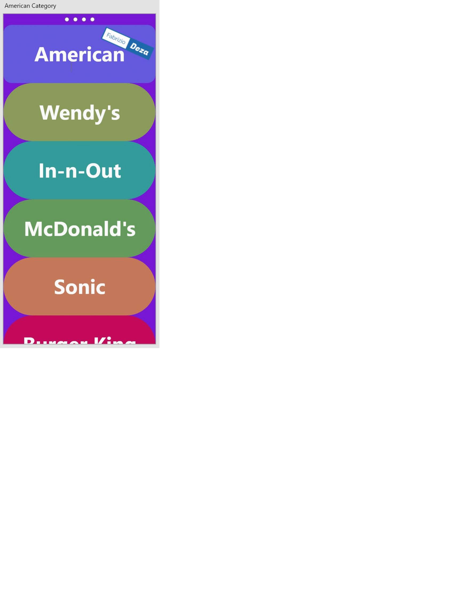

# RecsAndSpecsMidterm
Link:
https://github.com/fabriziodeza/RecsAndSpecsMidterm.git

Ethical Issues: 
1. An ethical dillema with this version of the application can be the storing of peoples personal information such as addresses and giving that to marketing companies.
2. Another ethical dilema includes finding people to deliver for (for Yo eats) who are well vetted and will no endager any user.
3. Another ethical issue that we may encounter is would be to not descriminate against our delivery staff and set a standard tip amount in their pay on the companies behalf.
Legal Issues:
1. A legal issue that we would encounter would be the food handling liscences that our delivery staff would have to recieve in order to apply Yo eats.
2. Another legal issue would be the privacy of our users. Denmark laws requires users to accepts the terms of how we handle information.
3. The last legal issue would be in regards to copyright laws and making sure that our app does not steal technology from uber eats for example.
Proffessional Issues: 
1. Professional issues that we could encounter would be staffing our new delivery service and onboarding correctly.
2. Another professional issue would be costumer service for the application to handle poor service or a bug in our code.
3. Lastly, on the code end of things, a problem that we may encounter is lack of efficient programming resulting in inefficient/slow code.

